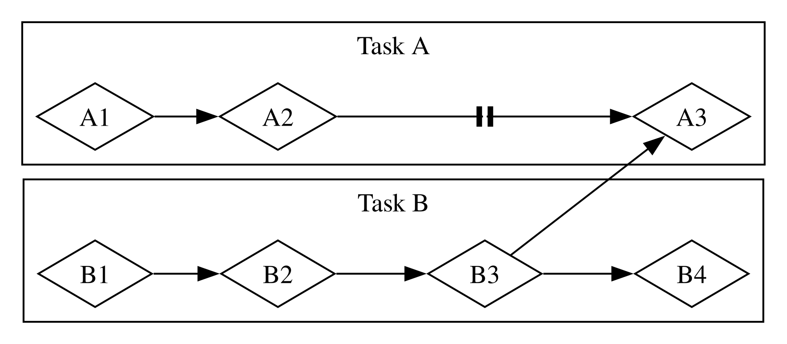

# Fundamentos da Programação Assíncrona: Async, Await, Futures e Streams

Muitas operações que pedimos para o computador realizar podem demorar um pouco para terminar. Seria ótimo se pudéssemos fazer outra coisa enquanto esperamos esses processos de longa duração concluírem. Os computadores modernos oferecem duas técnicas para trabalhar em mais de uma operação por vez: paralelismo e concorrência. A lógica dos nossos programas, no entanto, é escrita de maneira majoritariamente linear. Gostaríamos de poder especificar as operações que um programa deve realizar e os pontos em que uma função pode pausar e outra parte do programa ser executada em seu lugar, sem precisar especificar antecipadamente a ordem exata e a maneira como cada pedaço de código deve rodar. A _programação assíncrona_ é uma abstração que nos permite expressar nosso código em termos de potenciais pontos de pausa e resultados eventuais, cuidando dos detalhes de coordenação para nós.

Este capítulo baseia-se no uso de threads para paralelismo e concorrência do Capítulo 16, introduzindo uma abordagem alternativa para escrever código: as futures, streams e a sintaxe `async` e `await` do Rust, que nos permitem expressar como as operações podem ser assíncronas, além das crates de terceiros que implementam runtimes assíncronos: códigos que gerenciam e coordenam a execução de operações assíncronas.

Vamos considerar um exemplo. Digamos que você esteja exportando um vídeo que criou de uma celebração em família, uma operação que pode levar de minutos a horas. A exportação do vídeo usará tanta energia de CPU e GPU quanto possível. Se você tivesse apenas um núcleo de CPU e seu sistema operacional não pausasse essa exportação até que ela fosse concluída — ou seja, se executasse a exportação _sincronamente_ —, você não conseguiria fazer mais nada no computador enquanto essa tarefa estivesse rodando. Essa seria uma experiência bastante frustrante. Felizmente, o sistema operacional do seu computador pode, e faz, interromper invisivelmente a exportação com frequência suficiente para permitir que você faça outro trabalho simultaneamente.

Agora digamos que você esteja baixando um vídeo compartilhado por outra pessoa, o que também pode demorar um pouco, mas não consome tanto tempo de CPU. Nesse caso, a CPU precisa esperar os dados chegarem da rede. Embora você possa começar a ler os dados assim que eles começam a chegar, pode levar algum tempo para que todos apareçam. Mesmo quando todos os dados estiverem presentes, se o vídeo for muito grande, pode levar pelo menos um segundo ou dois para carregar tudo. Isso pode não parecer muito, mas é um tempo muito longo para um processador moderno, que consegue realizar bilhões de operações a cada segundo. Novamente, seu sistema operacional interromperá o seu programa invisivelmente para permitir que a CPU realize outro trabalho enquanto espera a chamada de rede terminar.

A exportação de vídeo é um exemplo de operação _limitada por CPU_ (ou _CPU-bound_ / _compute-bound_). Ela é limitada pela velocidade potencial de processamento de dados do computador dentro da CPU ou GPU, e por quanto dessa velocidade ela pode dedicar à operação. O download do vídeo é um exemplo de operação _limitada por E/S_ (ou _I/O-bound_), porque é limitada pela velocidade de _entrada e saída_ do computador; ela só pode ir tão rápido quanto os dados puderem ser enviados pela rede.

Em ambos os exemplos, as interrupções invisíveis do sistema operacional fornecem uma forma de concorrência. No entanto, essa concorrência acontece apenas no nível de todo o programa: o sistema operacional interrompe um programa para permitir que outros programas realizem seu trabalho. Em muitos casos, como entendemos nossos programas em um nível muito mais granular do que o sistema operacional, conseguimos identificar oportunidades de concorrência que o sistema operacional não consegue ver.

Por exemplo, se estamos construindo uma ferramenta para gerenciar downloads de arquivos, devemos ser capazes de escrever nosso programa de forma que iniciar um download não trave a interface de usuário (UI), e os usuários devem poder iniciar vários downloads ao mesmo tempo. No entanto, muitas APIs de sistemas operacionais para interagir com a rede são _bloqueantes_; isto é, elas bloqueiam o progresso do programa até que os dados que estão processando estejam completamente prontos.

> Nota: É assim que a _maioria_ das chamadas de função funciona, se você pensar bem. No entanto, o termo _bloqueante_ geralmente é reservado para chamadas de função que interagem com arquivos, rede ou outros recursos do computador, porque nesses casos um programa individual se beneficiaria de a operação ser _não_-bloqueante.

Podemos evitar o bloqueio da nossa thread principal criando uma thread dedicada para baixar cada arquivo. No entanto, a sobrecarga dos recursos do sistema usados por essas threads eventualmente se tornaria um problema. Seria preferível que a chamada não bloqueasse em primeiro lugar e que, em vez disso, pudéssemos definir várias tarefas que gostaríamos que nosso programa concluísse, permitindo que o runtime escolhesse a melhor ordem e maneira de executá-las.

Isso é exatamente o que a abstração _async_ (abreviação de _asynchronous_ / _assíncrono_) do Rust nos oferece. Neste capítulo, você aprenderá tudo sobre async enquanto cobrimos os seguintes tópicos:

- Como usar a sintaxe `async` e `await` do Rust e executar funções assíncronas com um runtime
- Como usar o modelo assíncrono para resolver alguns dos mesmos desafios que vimos no Capítulo 16
- Como multithreading e async fornecem soluções complementares que você pode combinar em muitos casos

Antes de vermos como o async funciona na prática, porém, precisamos fazer um breve desvio para discutir as diferenças entre paralelismo e concorrência.

## Paralelismo e Concorrência

Até agora, tratamos paralelismo e concorrência como termos quase intercambiáveis. Agora precisamos distingui-los com mais precisão, porque as diferenças aparecerão assim que começarmos a trabalhar.

Considere as diferentes maneiras pelas quais uma equipe pode dividir o trabalho em um projeto de software. Você pode atribuir várias tarefas a um único membro, atribuir uma tarefa a cada membro ou usar uma mistura das duas abordagens.

Quando um indivíduo trabalha em várias tarefas diferentes antes que qualquer uma delas esteja concluída, isso é _concorrência_. Uma maneira de implementar a concorrência é semelhante a ter dois projetos diferentes verificados no seu computador e, quando você fica entorpecido ou travado em um projeto, você muda para o outro. Você é apenas uma pessoa, então não pode progredir em ambas as tarefas exatamente ao mesmo tempo, mas pode fazer multitarefa, progredindo em uma de cada vez alternando entre elas (veja a Figura 17-1).

<figure>

<figcaption>Figura 17-1: Um fluxo de trabalho concorrente, alternando entre a Tarefa A e a Tarefa B</figcaption>

</figure>

Quando a equipe divide um grupo de tarefas fazendo com que cada membro pegue uma tarefa e trabalhe nela sozinho, isso é _paralelismo_. Cada pessoa na equipe pode progredir exatamente ao mesmo tempo (veja a Figura 17-2).

<figure>

<figcaption>Figura 17-2: Um fluxo de trabalho paralelo, onde o trabalho ocorre na Tarefa A e na Tarefa B de forma independente</figcaption>

</figure>

Em ambos os fluxos de trabalho, você pode precisar se coordenar entre diferentes tarefas. Talvez você achasse que a tarefa atribuída a uma pessoa era totalmente independente do trabalho de todos os outros, mas na verdade ela exige que outra pessoa da equipe termine sua tarefa primeiro. Parte do trabalho podia ser feita em paralelo, mas outra parte era na verdade _serial_: só podia acontecer em série, uma tarefa após a outra, como na Figura 17-3.

<figure>

<figcaption>Figura 17-3: Um fluxo de trabalho parcialmente paralelo, onde o trabalho ocorre na Tarefa A e na Tarefa B de forma independente até que a Tarefa A3 seja bloqueada pelos resultados da Tarefa B3.</figcaption>

</figure>

Da mesma forma, você pode perceber que uma das suas próprias tarefas depende de outra tarefa sua. Agora o seu trabalho concorrente também se tornou serial.

O paralelismo e a concorrência também podem se cruzar. Se você descobrir que um colega está travado até que você termine uma das suas tarefas, você provavelmente focará todos os seus esforços nessa tarefa para "desbloquear" seu colega. Você e seu colega de trabalho não conseguem mais trabalhar em paralelo, e você também não consegue mais trabalhar concorrentemente em suas próprias tarefas.

A mesma dinâmica básica entra em jogo com software e hardware. Em uma máquina com um único núcleo de CPU, a CPU pode realizar apenas uma operação por vez, mas ainda pode trabalhar concorrentemente. Usando ferramentas como threads, processos e async, o computador pode pausar uma atividade e alternar para outras antes de eventualmente retornar a essa primeira atividade. Em uma máquina com vários núcleos de CPU, ela também pode fazer trabalho em paralelo. Um núcleo pode estar executando uma tarefa enquanto outro núcleo executa uma tarefa completamente não relacionada, e essas operações realmente acontecem ao mesmo tempo.

Executar código assíncrono em Rust geralmente acontece de forma concorrente. Dependendo do hardware, do sistema operacional e do runtime assíncrono que estamos usando (mais sobre runtimes assíncronos em breve), essa concorrência também pode usar paralelismo por baixo dos panos.

Agora, vamos mergulhar em como a programação assíncrona no Rust realmente funciona.